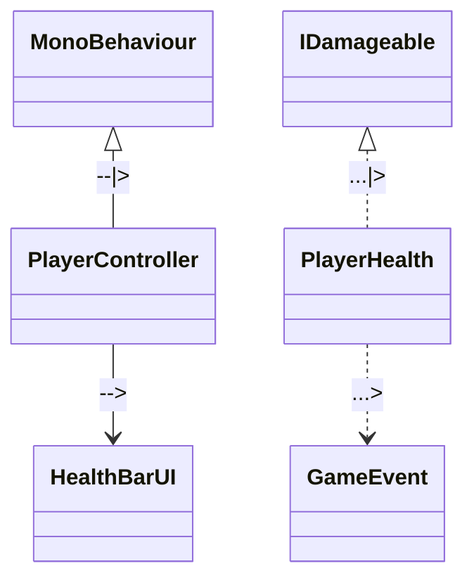

# Unity Project AI Agent Guidelines & Architecture Rules

The following guidelines and architectural constraints must be strictly adhered to by any AI coding agent operating within this workspace.

---

## 1. Context, Documentation & Artifact Ingestion (Read First)
1. **Always Read Project Documentation First**:
   - Before authoring code or making any architectural decisions, you MUST read the documentation located in `Assets/_Agents/` (specifically `ProjectDocumentation.md` and any task specs) to ensure full synchronization with the project roadmap.
2. **Artifact & Plan Placement Rule**:
   - Any implementation plans, architecture blueprints, feature breakdowns, or design documents generated during agent workflows MUST be saved as Markdown (`.md`) files inside:
     ```
     Assets/_Agents/_AntigravityArtifacts/
     ```
   - Never clutter the project root or code folders with planning notes.

---

## 2. Mandatory Custom UML Syntax & Diagramming Rules
When generating any UML / Mermaid diagrams, you MUST strictly use the project's custom arrow syntax. Do NOT use default or standard UML arrow interpretations:

| Arrow Syntax | Project Meaning | Context / Usage |
| :--- | :--- | :--- |
| `-->` | **Association** | Direct reference / holding an instance (e.g., `ClassA` holds `ClassB`) |
| `--\|>` | **Inheritance** | Class inheritance (e.g., `PlayerController` inherits `MonoBehaviour`) |
| `...>` | **Dependency** | Loosely coupled / Event dependency (e.g., C# Action, GameEventListener) |
| `...\|>` | **Implement Interface** | Interface implementation (e.g., `PlayerHealth` implements `IDamageable`) |

**Example Mermaid Diagram Snippet:**


---

## 3. Project Directory Structure
All scripts, assets, and project files must strictly follow the repository hierarchy:

```
Assets/
├── _Agents/
│   ├── ProjectDocumentation.md
│   └── _AntigravityArtifacts/     <-- All generated implementation & architecture plans go here
├── _Assets/
├── Animations/
├── Fonts/
├── Particles/
├── Prefabs/
├── Resources/
├── Scenes/
├── ScriptableObjects/
├── Scripts/
│   ├── Player/
│   ├── Settings/
│   ├── Shaders/
│   ├── Sounds/
│   └── ... (domain/feature-based modules)
├── Shaders/
└── Sounds/
```

- **Naming Conventions**: PascalCase for all C# scripts, ScriptableObjects, Prefabs, and Scene files.

---

## 4. Production & Engineering Standards
1. **Clean Code & SOLID Architecture**:
   - Write professional, modular, and decoupled C# code.
   - Avoid "God Classes" (e.g., combining movement, health, audio, and UI in a single script).
   - Keep classes focused on a single responsibility.
2. **Explicit Member Order & Formatting**:
   - Header comments & Namespaces
   - `[Header]` and `[SerializeField]` private fields
   - `public` properties & getters
   - Unity Lifecycle events (`Awake`, `OnEnable`, `Start`, `Update`, `FixedUpdate`, `OnDisable`, `OnDestroy`)
   - `public` API methods
   - `private` / internal helper methods
3. **Encapsulation First**:
   - Never make fields `public` solely to expose them in the Inspector. Always use:
     ```csharp
     [SerializeField] private float _moveSpeed = 5f;
     ```
   - Use PascalCase public properties with private setters when external read access is needed:
     ```csharp
     public float MoveSpeed => _moveSpeed;
     ```
4. **Decoupled Architecture & Design Patterns**:
   - Prefer **ScriptableObject Architecture** (modular data containers, runtime sets, game events) over static singletons.
   - Use the **Observer Pattern** (C# Actions/Events or UnityEvents) to eliminate hard scene coupling.
   - Employ patterns like **Strategy**, **State Machine**, or **Command** for complex entity logic.

---

## 5. Unity Performance & Memory Optimization
1. **Zero Per-Frame Allocations (`Update` / `FixedUpdate`)**:
   - **No LINQ or String Concatenation** inside `Update()` loops (causes GC spikes).
   - Cache non-allocating physics queries (e.g., `Physics.RaycastNonAlloc` instead of `Physics.RaycastAll` or `Physics2D.RaycastNonAlloc`).
   - Cache component references in `Awake()` or `Start()` — **NEVER call `GetComponent()`, `FindObjectOfType()`, or `GameObject.Find()` inside `Update()`**.
2. **Object Pooling**:
   - Never use runtime `Instantiate()` and `Destroy()` for frequently spawned entities (projectiles, particle bursts, damage numbers, enemy waves).
   - Always use an object pool (`UnityEngine.Pool.ObjectPool<T>` or a custom pool).
3. **Optimized Update Loops**:
   - Remove empty `Update()`, `Start()`, or `FixedUpdate()` methods from `MonoBehaviour` scripts to eliminate unnecessary native engine overhead.
   - Use `FixedUpdate()` strictly for physics / `Rigidbody` operations, and `Update()` for user input and visual interpolation.

---

## 6. Version Control & Unity Git Integrity
1. **Preserve `.meta` Files**:
   - `.meta` files contain GUIDs critical to Unity's asset serialization. **NEVER delete, rename, or move an asset outside the Unity Editor without updating/moving its accompanying `.meta` file**.
   - Ensure all new `.cs` files are created in their proper subfolders so Unity generates clean `.meta` pairings on recompilation.
2. **Scene & Prefab Merge Safety**:
   - Keep scenes minimal and modular. Prefer loading modular Prefabs rather than packing entire levels into single monolithic `.unity` scene files to avoid Git merge conflicts.
3. **Conventional Git Commits**:
   - Stage modified files (`git add .`) and commit with clear prefixes:
     - `feat(player): implement ScriptableObject dash ability`
     - `refactor(ui): decouple health bar listener from player controller`
     - `fix(physics): resolve non-alloc raycast buffer overflow`
