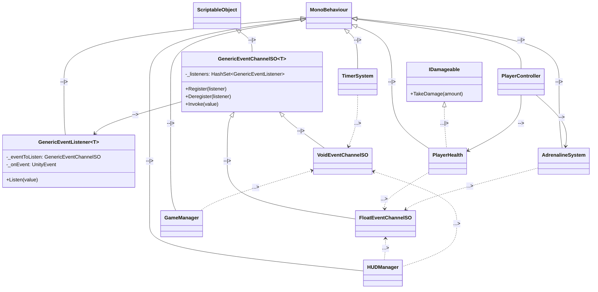

# Core Game Architecture Plan

Based on the Game Design Document (GDD) and Unity Project Rules, the architecture will follow a decoupled, event-driven approach (ScriptableObject Architecture) to ensure systems like the UI, Game State, and AI remain independent. 

## High-Level Architecture Diagram (Core Foundation)

## Systems Needed Before Expanding

Before we map out the complete game (which includes the AI state machines, traps, and complex combat), we need to establish the foundational systems to support a clean, scalable architecture:

### 1. ScriptableObject Event Architecture
We must build a generic Event System first. This avoids "God Classes" and tightly coupled singletons.
*   **Base Classes**: `GenericEventChannelSO<T>` and `GenericEventListener<T>`.
*   **Derived Channels**: Specific implementations like `VoidEventChannelSO` (for GameStarted, GameOver, TimeUp) and `FloatEventChannelSO` (for Adrenaline and Health updates).
*   **Event Listeners**: Derived MonoBehaviours that hook UnityEvents to these specific ScriptableObject GameEvents.

### 2. Game Manager & State Machine
The core loop heavily relies on states (Intro -> Gameplay -> Game Over/Coma). 
*   **GameManager**: Responsible for orchestrating scene flow and listening to end-game triggers (TimeUp Event, PlayerDead Event).

### 3. Strict Timer System
A standalone `TimerSystem` that counts down and broadcasts `TimeUp`. As per the GDD, this cannot be altered by gameplay, so it should be entirely independent and simply push time updates to the UI via an event channel.

### 4. Player Core Systems (Movement, Health, Adrenaline)
*   **PlayerController**: Handles new Input System actions (WASD).
*   **PlayerHealth**: Implements an `IDamageable` interface. Will broadcast a `HealthChanged` event and a `PlayerDead` event via event channels.
*   **AdrenalineSystem**: Modulates a speed multiplier based on gameplay actions, broadcasting its value via an event channel to adjust the `PlayerController`'s move speed.

Once these 4 foundational pillars are implemented and communicating via ScriptableObject Event Channels, we can safely extend the architecture to include the **AI Finite State Machine (FSM)** for Doctors/Security, the **Syringe Dash Combat**, and the **Trap/Pickup System**.
