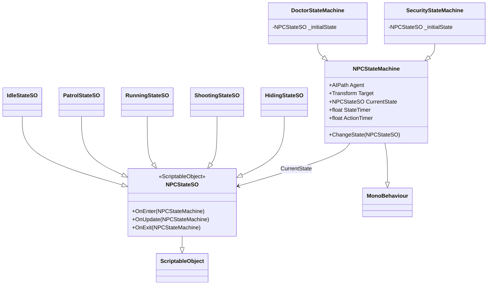
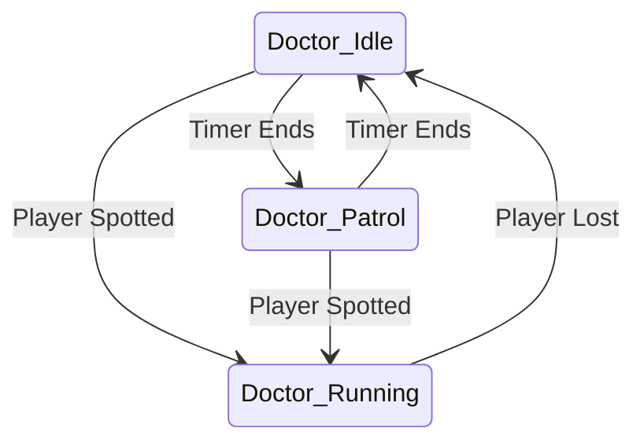
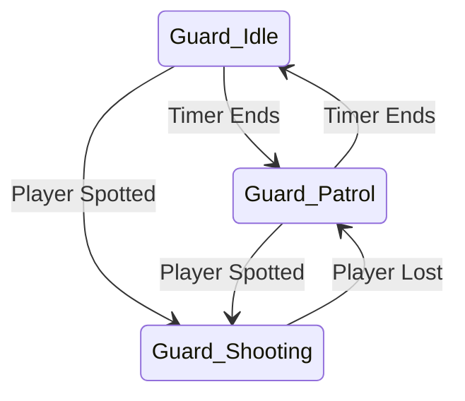

# NPC State Machine Architecture

## Overview
The NPC AI uses a **Stateless Flyweight ScriptableObject State Machine**.
This allows hundreds of enemies to share the exact same `StateSO` assets in memory without conflicts. All instance-specific data (like timers and current targets) is stored on the `NPCStateMachine` context.

## Class Diagram

## State Transitions (Node-Based)
Transitions are configured in the Unity Inspector by dragging SO assets into public fields (e.g., `stateWhenFinished`).

### Doctor

### Security Guard

